# Реализация небольшой сети офиса

### Структура работы
В папке `src` лежат конфиги отдельных устройств и `Lab1.uml`.
В папке `img` лежат скриншоты приложенные ниже.
Далее содержится описание работы и демонстрация работоспособности сети.

## Настройка

Топология сети:

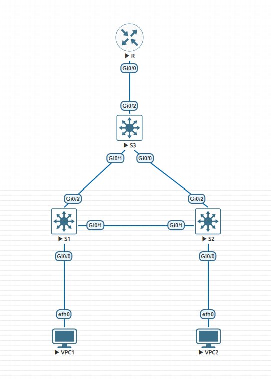

### Настройка клиентов

Настройка `VPC1`:

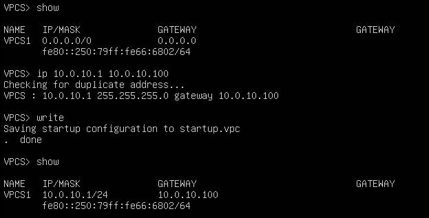

Настройка `VPC2`:

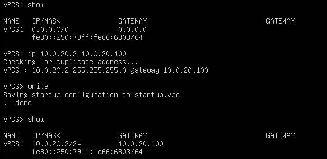

### Настройка коммутаторов уровня доступ

Настройка `S1`

Состояние перед настройкой:

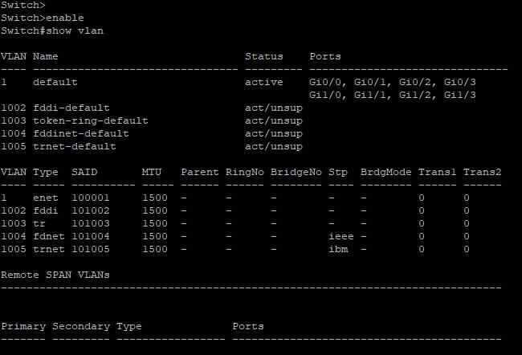

Конфигурация:

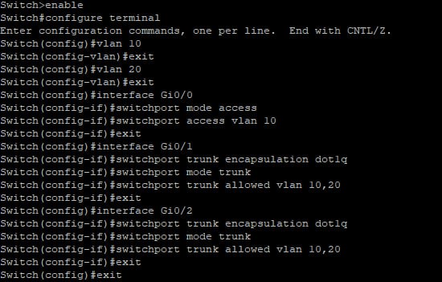

Состояние после настройки:

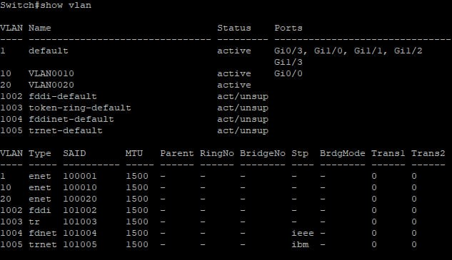

Настройка `S2` (почти аналогично)

Состояние перед настройкой:

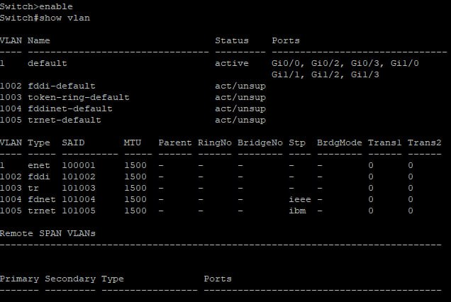

Конфигурация:

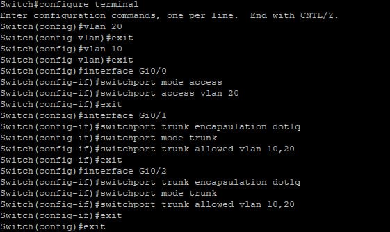

Состояние после настройки:

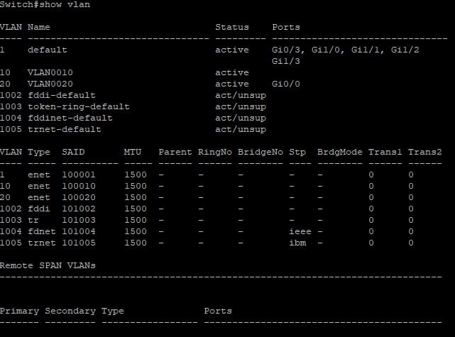

### Настройка коммутатора уровня распределения

Настройка `S3`

Состояние перед настройкой

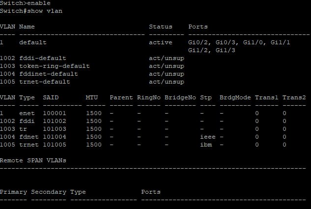

Конфигурация:

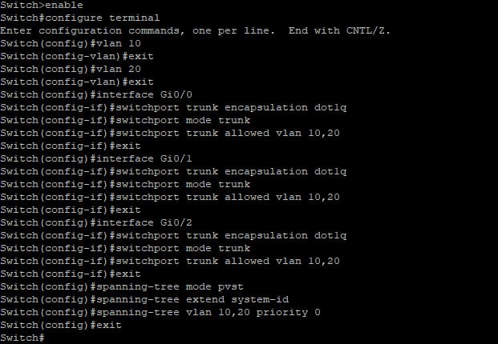

Состояние после настройки:

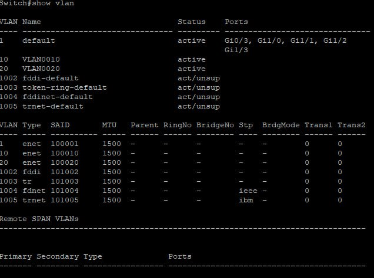

### Настройка маршрутизатора

Настройка `R`

Состояние перед настройкой:

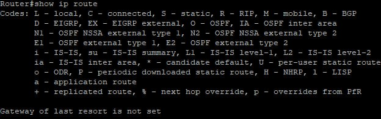

Конфигурация:

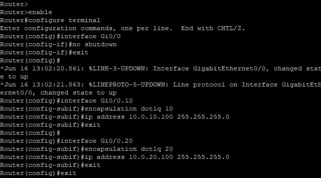

Состояние после настройки:

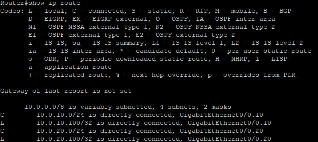

## Проверка работоспособности

Пинги с `VPC1`:

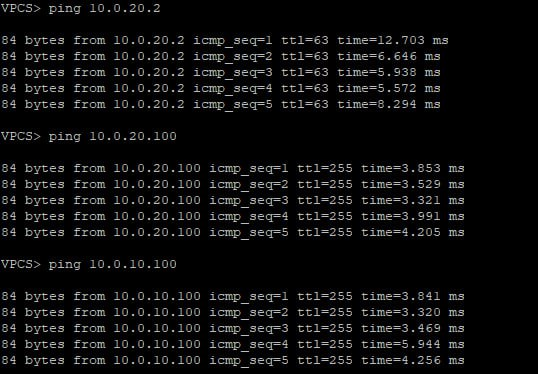

Пинги с `VPC2`:

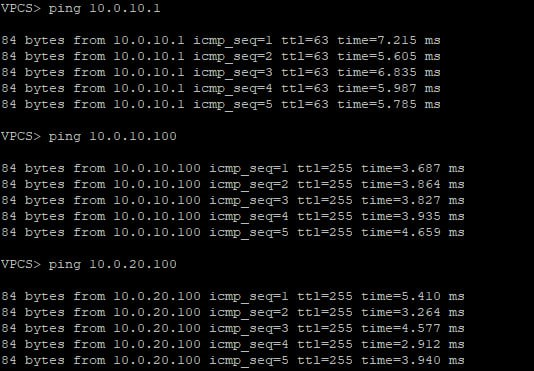

## Проверка STP

Spanning-tree `S1`:

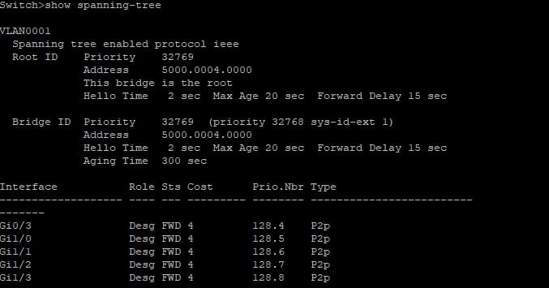
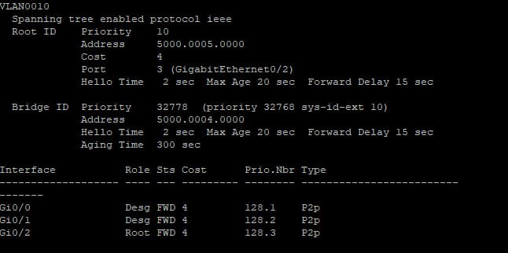
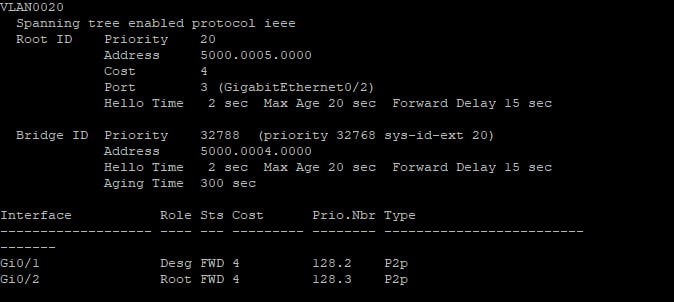

Spanning-tree `S2`:

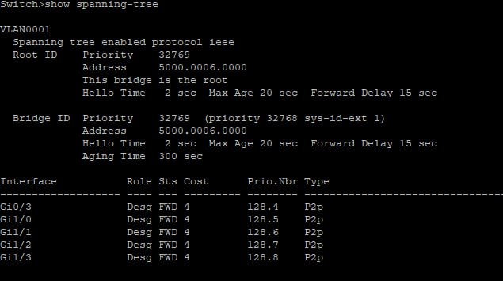
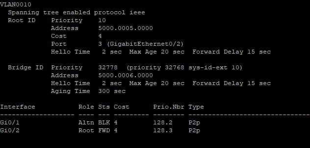
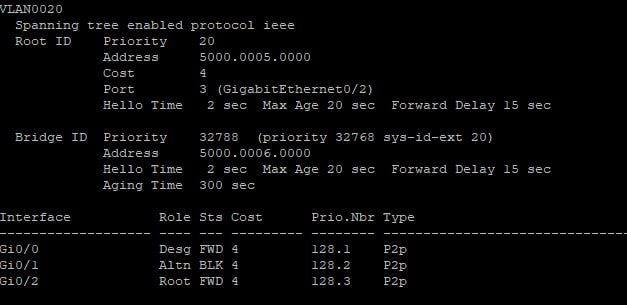

## Проверка отказоустойчивости

Отключаем интерфейс между `S3` и `S1`:

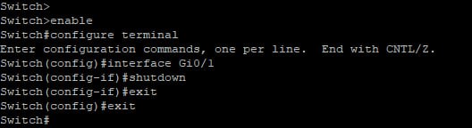

Пинги какое-то время не работают, но затем сеть восстанавливается:

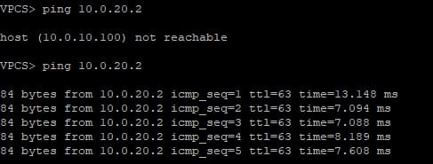
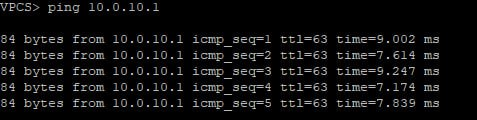
